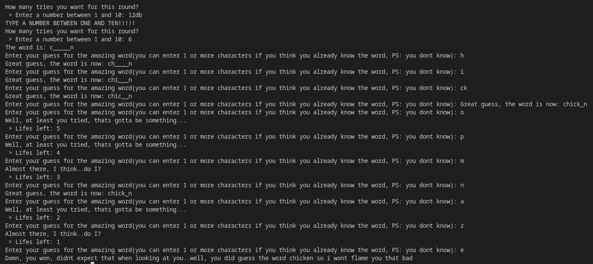

# C-Plus-Plus-Hangman
A simple hangman-like game created in C++ (this version is better than the one in C made by me)


The applications chooses from an array of words a random one and gives the player N tries to guess the word letter by letter, if the player chooses right, all secret spaces in the word that matched with the player's input will be shown, if not, the player's "lifes" will go down by one. Application has random responses to make it more appealing.

Self-made string functions made for making the job easier


>


>
```
#define WRONGROWS 4         // <- SET THIS NUMBER TO THE NUMBERR OF 'WORDS' IN THE "wrongGuesses[]" TABLE MINUS ONE (we have 4 'words' there, we place here 3)
#define WORDS 3            // <- THE SAME THING BUT DO IT FOR THE "words[]" TABLE
#include <iostream>
#include <string>
#include <string_view>
#include <limits>
using std::srand;
using std::rand;
using std::string;
using std::cout;
using std::cin;
using std::getline;
using std::string_view;
using std::numeric_limits;
using std::streamsize;
void gameLoop(bool* gameRunning, string_view WORD, string* displayWord, string wrongGuesses[], unsigned short int lifes);
int containsChar(string_view String, char character);
int getIndexFrom(string_view String, char character, size_t startIndex);

int main()
{
    // Seed
    srand(time(NULL));
    // Words
    string wrongGuesses[] = {"Well, at least you tried, thats gotta be something...",
                            "Are you making fun of me bro? Cmonn",
                            "Almost there, I think..do I?",
                            "How did you even think this was in the word?",
                            "Good guess but consider thinking more before you type..."};
    string words[] = {"chicken", "kitchen", "paper towel", "soda"};
    const string WORD = words[rand() % WORDS];
    string displayWord = WORD;
    for(size_t i = 1; i < WORD.length()-1; i++)
    {
        displayWord[i] = '_';
    }
    // Booleans
    bool gameRunning = true;
    // Lifes
    unsigned short int lifes{1};
    while(true)
    {
        cout << "How many tries you want for this round?\n > Enter a number between 1 and 10: "; cin >> lifes;
        if(cin.fail() || lifes > 10 || lifes < 1){
            cin.clear();
            cin.ignore(numeric_limits<streamsize>::max(), '\n');
            cout << "TYPE A NUMBER BETWEEN ONE AND TEN!!!!!\n";
            continue;
        }
        break;
    }
    // Display Word
    cout << "The word is: " << displayWord << "\n";
    // Game loop
    gameLoop(&gameRunning, WORD, &displayWord, wrongGuesses, lifes);
}

void gameLoop(bool* gameRunning, string_view WORD, string* displayWord, string wrongGuesses[], unsigned short int lifes)
{
    // Seed
    srand(time(NULL));
    // Indexes
    size_t charIndex{0};
    // Characters
    char guess;
    // Words
    string_view wrongGuess = wrongGuesses[rand() % (sizeof(*wrongGuesses)/sizeof(string))];
    // Main loop
    while(gameRunning)
    {
        cout << "Enter your guess for the amazing word(you can enter 1 or more characters if you think you already know the word, PS: you dont know): "; cin >> guess;
        if(containsChar(WORD, guess))
        {
            charIndex = 0;
            while(true)
            {
                charIndex = getIndexFrom(WORD, guess, charIndex);
                if(charIndex == -1)
                {
                    break;
                }
                displayWord->at(charIndex) = WORD[charIndex];
                charIndex++;
            }
            if(*displayWord == WORD)
            {
                cout << "Damn, you won, didnt expect that when looking at you..well, you did guess the word " << *displayWord << " so i wont flame you that bad\n";
                return;
            }
            cout << "Great guess, the word is now: " << *displayWord << "\n";
        }
        else
        {
            lifes--;
            if(lifes == 0)
            {
                cout << "Game over bro, how did you lose to a game like hangman bruh";
                return;
            }
            else
            {
            cout << wrongGuess << "\n";
            wrongGuess = wrongGuesses[rand() % WRONGROWS];
            cout << " > Lifes left: " << lifes << "\n";
            }
        }
        cin.clear();
    }
}

// Utilities
int containsChar(string_view String, char character)
{
    for(size_t i{0}; i < String.length(); i++)
    {
        if(String[i] == character)
        {
            return 1;
        }
    }
    return 0;
}
int getIndexFrom(string_view String, char character, size_t startIndex)
{
    for(size_t i{startIndex}; i < String.length(); i++)
    {
        if(character == String[i])
        {
            return i;
        }
    }
    return -1;
}
```
